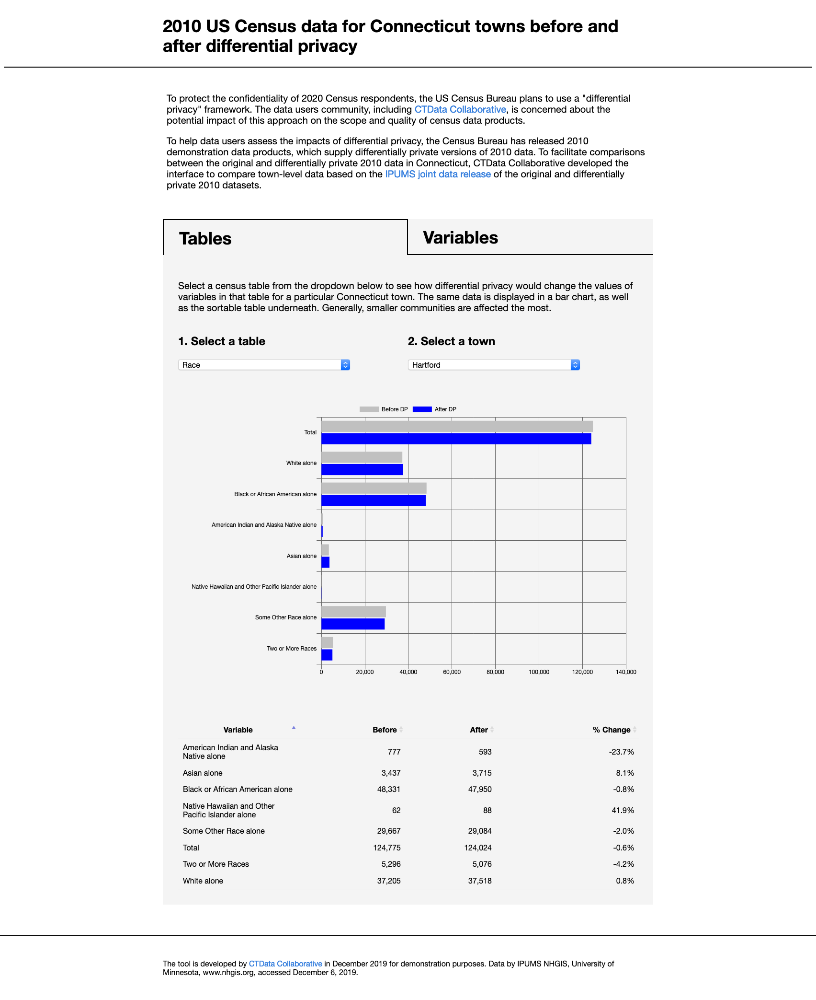

# Differential Privacy Demo Tool (2010 US Census data)
This tool was developed by CTData Collaborative in December 2019 for demonstration purposes and modified by VCGI with data for Vermont.

## About
To protect the confidentiality of 2020 Census respondents, the US Census Bureau plans to use a "differential privacy" framework. The data users community is concerned about the potential impact of this approach on the scope and quality of census data products. To help data users assess the impacts of differential privacy, the Census Bureau has released 2010 demonstration data products, which supply differentially private versions of 2010 data. To facilitate comparisons between the original and differentially private 2010 data, CTData Collaborative developed the interface to compare town-level data based on the IPUMS joint data release of the original and differentially private 2010 datasets.

## Credits
- Inspired by https://shiny.demog.berkeley.edu/eddieh/DP2010DemoData_CA/ (also on GitHub: https://github.com/edyhsgr/DP2010DemoDataReview)
- Data by IPUMS NHGIS, University of Minnesota, www.nhgis.org, accessed December 6, 2019. https://www.nhgis.org/differentially-private-2010-census-data (county subdivision)

## Screenshot

